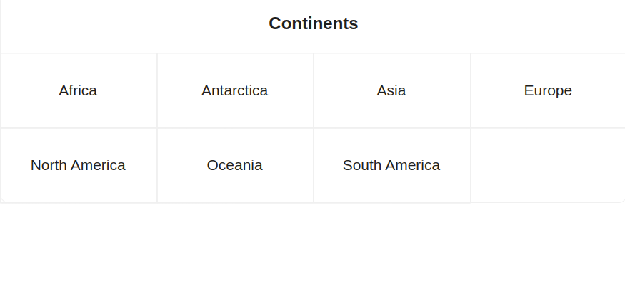
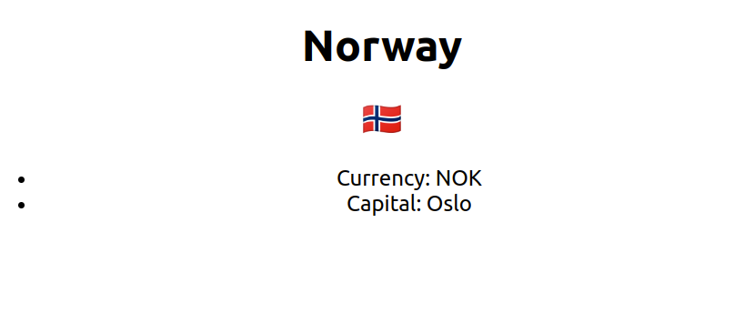
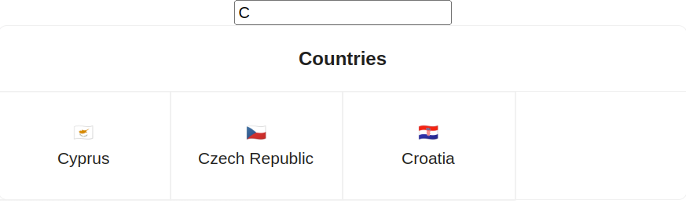

# Checkpoint Alternance Dev CDA

Les exercices sont indépendants les uns des autres.

**Disclaimer**

Il vaut mieux livrer un exercice incomplet et/ou comportant des bugs plutôt que de ne rien soumettre.

**Avant de commencer**

- Crée un nouveau repo et clone ton projet en local

**A chaque fois que tu avances dans une fonctionnalité:**

- Fais un commit avec un message explicite
- Fais un push

## Partie 1 : Frontend

Crée un nouveau projet React Typescript avec Create React App.

Tu vas utiliser une API GraphQL qui fournit des informations sur un pays : https://countries.nausicaa.wilders.dev/

- La query `continents` fournit une liste de continents avec un code et un nom (ex : `{code:"EU", name:"Europe"}`)

- La query `continent` prend un code de continent en paramètre et retourne une liste de pays

- La query `country` prend un code de pays en paramètre et retourne le nom, la capitale, la monnaie et le drapeau du pays

Pour réaliser ce projet, tu peux si tu le souhaites utiliser https://reactrouter.com/en/main pour la gestion des routes en local ainsi que la biliothèque de composants https://ant.design/

Tu vas devoir développer 3 pages dans ce projet :

- Une page qui affiche la liste des liens vers chaque continent



- Une page qui affiche, pour un continent donné, la liste des liens vers chaque pays


- Une page qui affiche les détails d'un pays donné



Bonus :

- Les pages affichant une liste contiennent un champ de texte permettant de filtrer les éléments



## Partie 2 : Backend

Crée un nouveau projet NodeJS Typescript.

Pour un meilleur confort de dev, utilise ts-node-dev.

Le but de cet exercice est de créer une API GraphQL avec Apollo Server et Typegraphql pour enregistrer et lire des pays avec leur code, leur nom et leur emoji.

Utilise une base de données SQLite et TypeORM en ORM.

Voici les packages dont tu auras besoin et leur version :

```
  "dependencies": {
    "apollo-server": "^3.11.1",
    "class-validator": "^0.14.0",
    "reflect-metadata": "^0.1.13",
    "sqlite3": "^5.1.4",
    "ts-node-dev": "^2.0.0",
    "type-graphql": "^1.1.1",
    "typeorm": "^0.3.12"
  }
```

Crée une mutation qui prend en paramètres :

- un code (FR, BE, AN, ...),
- un nom (France, Belgique, Andorre, ...),
- un emoji (🇫🇷, 🇧🇪, 🇦🇩, ...),

et qui enregistre cette entrée en BDD.

Crée ensuite 2 queries :

- Une qui renvoie la liste de tous les pays (avec pour attributs, pour chaque pays, le code, le nom, l'emoji)
- Une autre qui prend en paramètre le code du pays et qui renvoie le pays en question

Bonus :

- Ajoute un code continent à la mutation d'ajout de pays et une query qui permet de récupérer tous les pays d'un continent

## Partie 3 : Base de données

Dans cet exercice il s'agira d'abord de modéliser puis de créer la base de données d'un job board.

Un job board est un site internet qui permet aux entreprises de publier des offres d'emploi.

Voici les contraintes de la base de données du job board :

- Un recruteur peut s'enregistrer sur le site
- Une fois enregistré il peut créer une seule entreprise
- Il peut ensuite publier des offres au nom de l'entreprise

- Un candidat peut s'enregistrer sur le site
- Une fois enregistré il peut consulter les offres
- Il peut ensuite candidater à des offres

- Le candidat peut retrouver toutes les entreprises auxquelles il a candidaté
- Le recruteur peut retrouver les informations des candidats qui ont postulé à une offre

Un recruteur a les attributs suivants :

- login
- mot de passe

Un candidat a les attributs suivants :

- login
- mot de passe
- nom
- prénom
- email
- numéro de téléphone
- texte de présentation

Une entreprise a les attributs suivants :

- nom
- description

Une offre a les attributs suivants :

- titre du poste
- descriptif du poste
- ville du poste

### 3.1 Modélisation

Modélise le MPD de la base de données, https://www.dbdesigner.net/ te permettra d'exporter la BDD au format SQLite ce qui te sera utile par la suite.

### 3.2 SQL

Crée la base de données avec SQLite et remplis-la avec des données fictives.

Écris ensuite les requêtes SQL permettant d'obtenir les informations suivantes :

- Toutes les offres d'emploi
- Toutes les offres d'emploi d'une ville (Paris)
- Les informations de tous candidats qui ont postulé à une offre précise
- Les informations de tous les candidats qui ont postulé aux offres d'une entreprise
