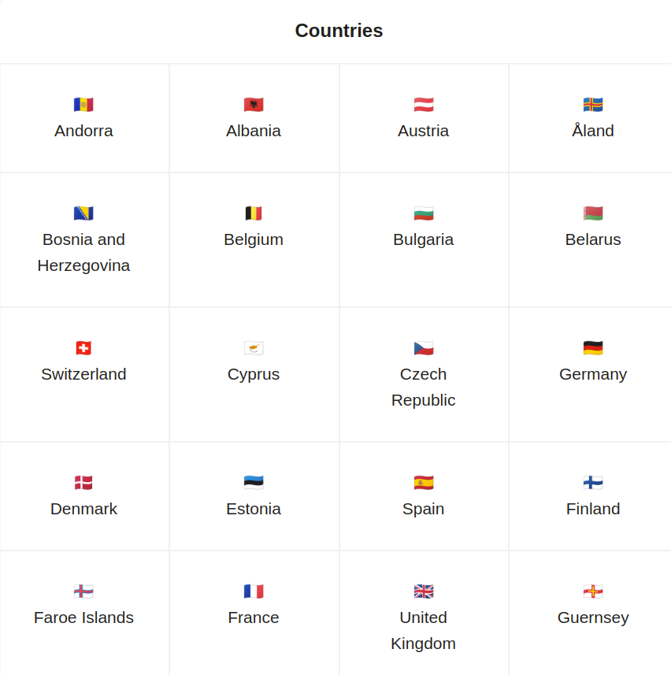

# Checkpoint Alternance Dev CDA

**Avant de commencer**

- Clone ce projet

**A chaque fois que tu avances dans une fonctionnalité:**

- Fais un commit avec un message explicite.
- Fais un push.

## Partie 1: Frontend

Crées un nouveau projet React Typescript avec create react app

Tu vas consommer une API GraphQL qui fournit des informations sur un pays: https://countries.nausicaa.wilders.dev/ .

La query countries fournit une liste de codes de pays (FR, BE, CA, ...)

La query country prend en paramètre un code de pays et renvoie entre autres le nom du pays et l'emoji de son drapeau

L'application React doit récupérer la liste de tous les codes de pays et ensuite permettre de naviguer de code en code pour afficher le nom du pays et son emoji drapeau



## Partie 2: Backend

Crées un nouveau projet NodeJS Typescript

Pour un meilleur confort de dev, utilise ts-node-dev

Le but de cet exercice est de créer une API GraphQL avec Apollo Server et Typegraphql pour enregistrer et lire des pays avec leur code, leur nom et leur emoji.

Utilise une base de données SQLite et TypeORM en ORM.

Voici les packages dont tu auras besoin et leur version:

```
  "dependencies": {
    "apollo-server": "^3.11.1",
    "class-validator": "^0.14.0",
    "reflect-metadata": "^0.1.13",
    "sqlite3": "^5.1.4",
    "ts-node-dev": "^2.0.0",
    "type-graphql": "^1.1.1",
    "typeorm": "^0.3.12"
  }
```

Crées une mutation qui prend un en paramètre

- un code (FR, BE, AN, ...)
- un nom (France, Belgique, Andorre, ...)
- un emoji (🇫🇷, 🇧🇪, 🇦🇩, ...)

et qui enregistre cette entrée en BDD

Crées ensuite 2 query:

- Une qui renvoie la liste de tous les pays avec le code, le nom et l'emoji
- Une autre qui prend en paramètre le code du pays et qui renvoie le pays en question
